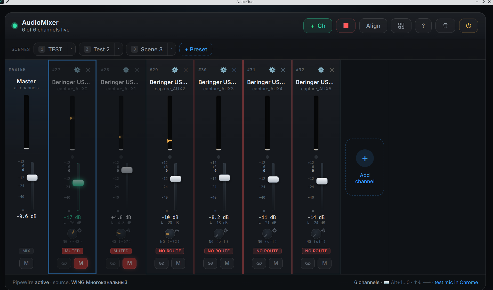

<div align="center">

# 🎚️ AudioMixer

### A web mixing console for PipeWire — turn any device channel into its own virtual microphone.

[](LICENSE)
[](#requirements)
[](https://pipewire.org)
[](https://github.com/metallcorn/pwmicmix/releases/latest)



</div>

---

AudioMixer takes individual channels of your real audio hardware — separate USB sends of a
**Behringer WING**, a webcam mic, a speaker monitor — and publishes **each one as its own
virtual microphone** (`Audio/Source`) that any app (Chrome, OBS, Zoom, Meet, Discord…) can
pick from its input list. Control it from a dark, adaptive console in the browser, or from
your **phone on the same network**.

It runs as a single-file **AppImage** (a native desktop window) or straight from source.

## ✨ Features

- 🎙️ **Virtual mics** from any port of any device — sources *and* sink monitors.
- 📊 **Real-time VU meters** — log dB scale, fast-attack/slow-release ballistics, peak-hold, clip indicator.
- 🎚️ **dB faders** with up to **+12 dB boost**, scale ticks, mouse-wheel control, click-to-type the dB value.
- 🔇 **Mute** + 🟡 **Solo** per channel, plus a global **master mute**. (Solo silences everyone else; it clears the channel's mute.)
- 🚪 **Broadcast noise gate** per channel — threshold + attack / hold / release / hysteresis, with a settings popup and "apply to all / linked".
- 🔗 **Link faders** (move several as one) and **Align** them to an anchor.
- 🎬 **Scene presets** — snapshot the whole mix (gain, mute, solo, gate, master, links); motorized-fader glide on recall; stored locally and on disk.
- 📱 **Phone access** — a **QR button** shows a code with the PIN baked in; scan and you're connected, with a network-interface picker.
- 🖥️ **Native window** (AppImage) with proper taskbar icon on GNOME & KDE; **in-UI Quit / Restart** (no terminal needed) and a close-confirmation.
- 🔍 **UI zoom** — `Ctrl +/−/0` or `Ctrl+wheel`, scales the whole console (great on 2K/4K).
- ♻️ **Survives restarts** — the virtual mics keep running across a server restart/replug, so apps never drop the input or get noise.
- ⌨️ **Keyboard-driven** — see the in-app `?` panel.

## 📦 Install (AppImage)

Grab the latest `AudioMixer-x86_64.AppImage` from the
**[Releases page](https://github.com/metallcorn/pwmicmix/releases/latest)**, then:

```bash
chmod +x AudioMixer-x86_64.AppImage
./AudioMixer-x86_64.AppImage
```

No installation, nothing written to system dirs (settings live in `~/.config/AudioMixer`).

### Requirements

| Need | Why |
|------|-----|
| Linux **x86_64** | the binary architecture |
| glibc **≥ 2.34** | Ubuntu 22.04+ / Fedora 35+ / Debian 12+ / recent Arch/Mint |
| **PipeWire** + its CLI tools | the app drives host `pw-record` / `pw-cli` / `pw-link` / `pw-loopback` / `pw-dump` (intentionally *not* bundled, so they match your daemon) |
| A desktop session | X11 or Wayland |

10-second check on a target machine:

```bash
ldd --version | head -1        # ≥ 2.34
which pw-record pw-cli pw-link  # all found
```

> No FUSE? Run it as `./AudioMixer-x86_64.AppImage --appimage-extract-and-run`.

## 🛠️ Run from source

```bash
git clone git@github.com:metallcorn/pwmicmix.git
cd pwmicmix
./run.sh            # creates a venv, installs Flask + qrcode, starts the server
```

Then open **http://localhost:8723**. localhost is trusted (no PIN); remote devices use the
4-digit **PIN** printed in the startup banner.

## 🎛️ Using it

**Topbar:** `+ Ch` add channel · `▶ / ■` start/stop all mics · `Align` · `QR` connect a phone ·
`?` shortcuts · `🗑` remove all · `⟳` restart · `⏻` quit.

**Per channel:** drag the fader (wheel / click-dB to type) · the `▸` marker or `NG` knob +
gear set the noise gate · `S` solo · `M` mute · chain icon links faders · `⚙ / ✕` (top)
reassign source / remove · double-click the name to rename.

### Keyboard shortcuts

| Keys | Action |
|------|--------|
| `Alt`+`1…9` / `Alt`+`0` | select channel / master |
| `←` `→` | switch channel |
| `↑` `↓` (`Shift` = big step) | volume |
| `[` `]` | noise-gate threshold |
| `M` / `Alt`+`M` / `Ctrl`+`Alt`+`M` | mute channel / link group / master |
| `S` / `Alt`+`S` | solo channel / link group |
| `L` / `Alt`+`L` | link selected / unlink all |
| `N` | align link group |
| `1…9` | recall scene preset |
| `Ctrl`+`=` `−` `0` / `Ctrl`+wheel | zoom the UI |

## 🧩 How it works

```
Hardware port  --pw-link-->  am_cap_<id> (loopback capture, autoconnect=false)
                                  |  (loopback)
                                  v
                          am_mic_<id> (Audio/Source)  <-- apps record this
                                  ^
                          pw-record  --> RMS --> live meters
```

Each channel is one `pw-loopback`; the chosen device port is explicitly linked into its
capture side, and the playback side is a mono `Audio/Source`. Applied volume =
`gain × master × gate_envelope` (0 if muted/soloed-out). Levels and the per-channel
pre-gain gate detector both use `pw-record`. Nodes are started detached so they survive a
server restart and get **adopted** on the next launch. Full notes: [`CLAUDE.md`](CLAUDE.md).

## 🏗️ Building the AppImage

```bash
bash packaging/build-appimage.sh        # → AudioMixer-x86_64.AppImage (~202 MB)
```

Bundles a portable Python + Flask/numpy/qrcode + **pywebview/Qt WebEngine** (the native
window), trims Qt to just what's needed, and packs with `appimagetool`. The host `pw-*`
tools are used at runtime, not bundled. Releases are built automatically by CI on every
`vX.Y.Z` tag (see [`.github/workflows/release.yml`](.github/workflows/release.yml)).
Deep dive: [`packaging/NOTES.md`](packaging/NOTES.md).

## ✅ Tests

```bash
.venv/bin/python test_app.py
```

Functional suites against the real implementation: control endpoints actually change the
PipeWire node volume (volume / mute / master / gate envelope / persistence / presets), and
the noise-gate dynamics (threshold / attack / hold / release / hysteresis).

## 📄 License

[GPL-3.0](LICENSE) © metallcorn
